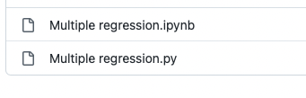

   

# Implementing Statistical Models From Scratch!

## Project Description

I have been applying different statistical models in [my scientific research](https://christianfang95.github.io/pubs/), I have even been teaching some of these methods to Bachelor students, but I still thought that I did not really fully understand, let alone was able to explain the basic steps of what goes on behind the scenes when you run, for example, a linear regression model.

Therefore, I decided to hand-code some of the most commonly used models by myself and providing thoroughly annotated code that shows the mathematical background as well as their implementation in Python.

Sure, there are many tutorials already, but I found that most (all?) of them are somewhat limited in scope. In case of linear regression for example, most tutorials only show how to get the intercept and slope estimates. The confidence intervals of the parameter estimates, the standard errors, t- and p-values are usually omitted. Model fit statistics, such as the R2, are also often not calculated. All that information is, however, necessary to really make sense of any model.

Therefore, I decided to implement all models as comprehensively as possible, to closely mimic the output that you would get from, for example, [statsmodels](https://www.statsmodels.org/stable/index.html) or [Stata](https://www.stata.com).

## How to Use the Project

Inside the repository, you find different folders. Each folder contains two files: - a Jupyter Notebook (extension ".ipynb") that contains the code with lots and lots of explanation and math, and - a Python script (extension ".py") that contains just the annotated code.

For example, inside the "OLS regression" folder, you will find the following two files:

I would recommend reading the Jupyter Notebooks first, and then download and run the Python scrips by yourself on your own machine. Feel free to run the scripts with your own data!

## Acknowledgements

Thanks, [Qixiang Fang](https://github.com/fqixiang) for checking my code and math!

Thanks, [Jos Slabbekoorn](https://github.com/jossl95) for all your helpful and nitpicky Python tips!

## License

All files in this project are licensed under the [MIT license](LICENSE.txt).
